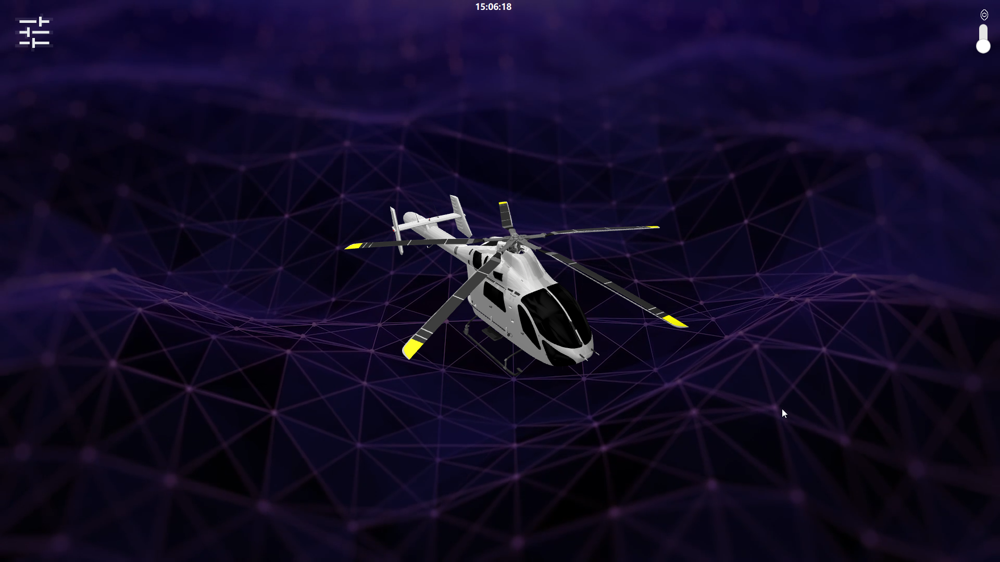
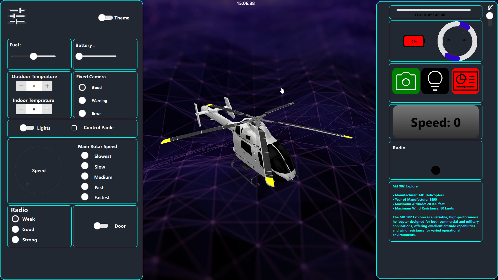
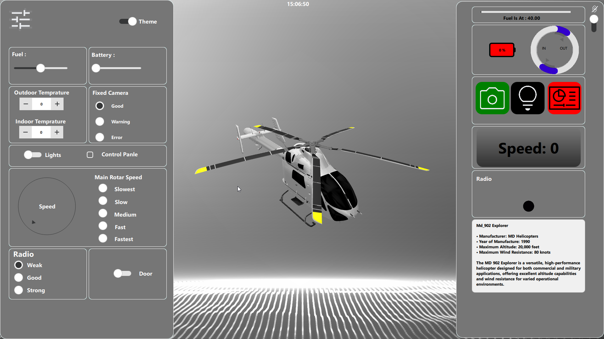

# 🚁 Helicopter QML Simulation Dashboard

A modern **Qt/QML-based helicopter simulation dashboard** featuring a **3D helicopter model**, animated UI components, synchronized control panels, and dynamic theme switching.  
This project demonstrates advanced usage of **Qt Quick**, **Qt Quick Controls**, and **Qt Quick 3D** to build an interactive and visually rich application.

---

## ✨ Features

- 🎨 **Theme Switching**
  - Toggle between UI themes dynamically
  - Smooth visual transitions

- 🖥️ **Synchronized Control Panel**
  - UI controls update live data displays
  - Real-time feedback with animations

- 🚁 **3D Helicopter Model**
  - Interactive **Qt Quick 3D** helicopter
  - Realistic positioning and rotation
  - Integrated into a modern HUD-style UI

- 📊 **Live Indicators & Widgets**
  - Fuel level gauge
  - Speed indicator
  - Battery status
  - Temperature controls (Indoor / Outdoor)
  - Radio signal strength
  - Camera status indicators

- 🎥 **Smooth Animations**
  - Animated gauges and controls
  - Responsive UI behavior

- 🪟 **Standalone Executable**
  - Prebuilt `.exe` file included
  - Can be run without Qt installation

---

## 🖼️ Screenshots

### Main Interface

### Control Panel & Indicators

### Theme Change Preview

---

## 🎬 Demo Video

---
